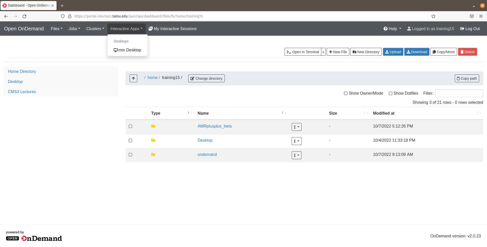
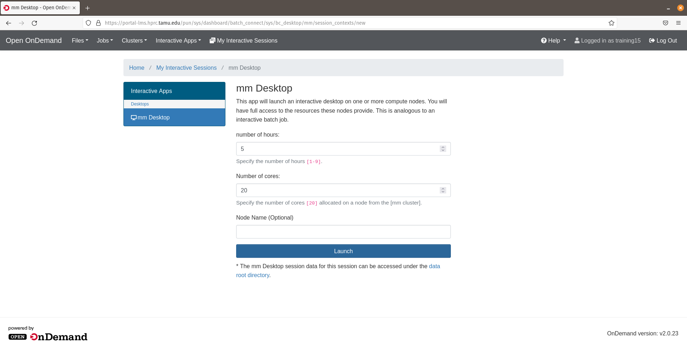
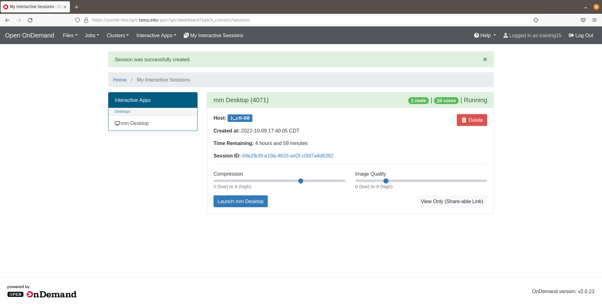
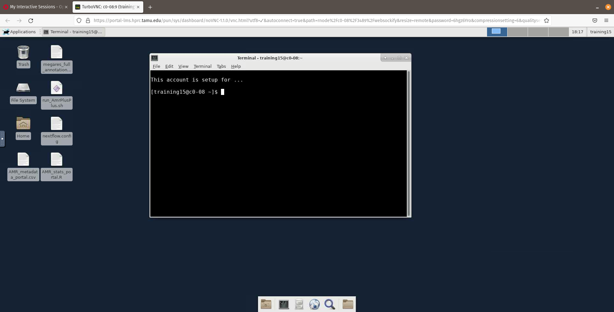
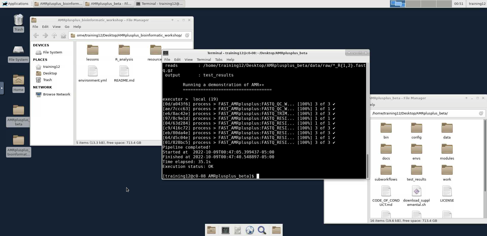
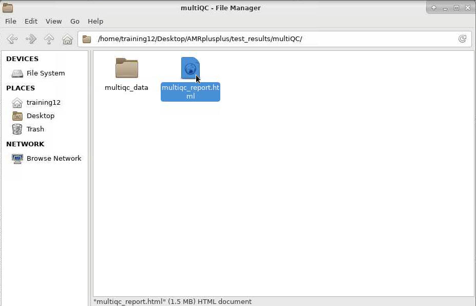
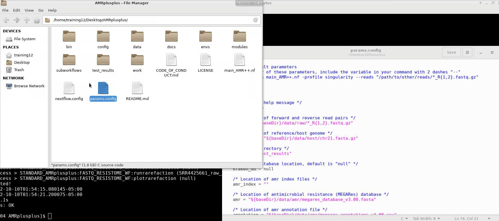
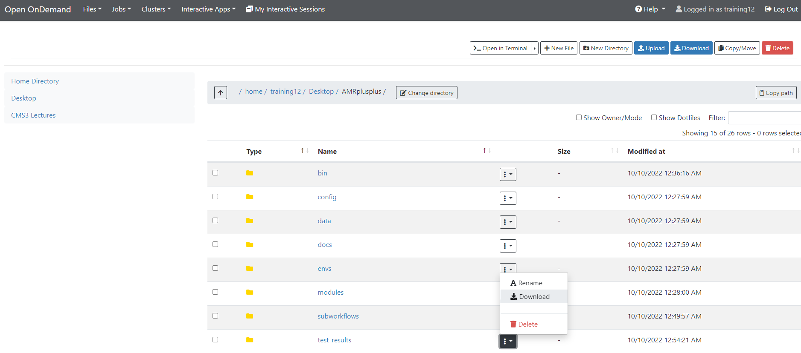

# Bioinformatics - Running the AMR++ pipeline

### Table of contents
* [Login](#log-into-training-portal)
* [Command-line basics](#command-line-basics)
* [Using terminal to run a pipeline](#using-terminal-to-run-a-pipeline)
* [Exploring results](#exploring-results)
* [Run with sbatch script](#running-the-pipeline-with-a-script)
* [Qiime2 example](#another-example---running-qiime2)


## Log into training portal

Make sure you can enter the TAMU training portal following [these instructions](./TAMU_Training_portal.md).

Now, from your dashboard we will launch the interactive compute nodes to connect us to the HPC cluster resources. This is where we will run the AMR++ pipeline! Hover over the `Interactive Apps` dropdown tab and click on the `mm Desktop` button to connect.





You will now be able to choose the number of hours let go with 5 and by default 20 cores to use for the workshop. Click the `Launch` to start the queue to load the Interactive Desktop.





You will be queued for a brief moment and then once your session is created we will click the `Launch mm Desktop` button to launch a new web browser tab with your Interactive Desktop.





------------------------------------------
------------------------------------------

## Using terminal to run a pipeline
Now on your new Interacivte Desktop tab, click on the terminal emulator app and then we will begin the command-line portion of the workshop!





### Download files using github
To download AMR++, run the following command:
```bash
$ git clone https://github.com/EnriqueDoster/AMRplusplus.git
```

Next, lets download the files we'll use for the workshop with the following command:
```bash
$ git clone https://github.com/Microbial-Ecology-Group/AMRplusplus_bioinformatic_workshop.git
```

We can quickly get a glimpse at what we just downloaded. You can also click on the folders to look through the files.
```bash
$ ls AMRplusplus_bioinformatic_workshop
$ ls AMRplusplus
```

### Preparing to run AMR ++

To start your AMR++ run, go back to the terminal. Now, we'll navigate into the AMR++ directory and use `ls` to view the contents.
```bash
$ cd AMRplusplus
$ ls
```

From this directory, you can run a demonstration of AMR++, but first we'll need to load a module to use a function called `nextflow`. Outside of this workshop, how you make `nextflow` available will vary based on your computing cluster. At the bare minumum, we'll need to use two software; `nextflow` and `singularity`. Here we'll test whether we have either of those programs available.

```bash
$ nextflow
$ singularity
```

As you can see, nextflow does work, however, singularity does not. In this portal, we just need to run this command to load `nextflow`.

```bash
$ module load Nextflow
```

Now, nextflow works:
```bash
$ nextflow -h
```

Finally, we can run AMR++ with this command: 
```bash
$ nextflow run main_AMR++.nf -profile singularity_workshop
```


The standard output to the terminal screen is interactive. Once the run has finished it should look similar as the image below:





## Running your own data with AMR++


Lets look at the TE reads that we'll be using. 
```bash
$ ls /home/training/AMR_workshop_reads/small_subsample/
```

To analyze these reads, we can use a similar command for AMR++, but we have to change the ``--reads`` parameter. 
```bash
$ nextflow run main_AMR++.nf -profile singularity_workshop --reads "/home/training/AMR_workshop_reads/small_subsample/*_{1,2}.fastq.gz"
```

First, however, we might want to evaluate quality of your sequencing reads with the ```--pipeline eval_qc``` option. Let's also change the ```--output`` directory.
```bash
$ nextflow run main_AMR++.nf -profile singularity_workshop --reads "/home/training/AMR_workshop_reads/small_subsample/*_{1,2}.fastq.gz" --pipeline eval_qc --output QC_output
```

Let's take a look at those files to evaluate our sequence sample quality:



Now, we can open and modify the "params.config" file to change the trimming parameters.




Finally, we can run the standard AMR pipeline, and change the ``--output`` flag.
```bash
$ nextflow run main_AMR++.nf -profile singularity_workshop --reads "/home/training/AMR_workshop_reads/small_subsample/*_{1,2}.fastq.gz" --pipeline standard_AMR --output TE_AMR++_output
```

## Exploring results


Next we will move back to our portal dashboard and download our AMR++ output files locally to our computers to further explore them!




* Using excel or another program, open the file "test_results/RunQC/Stats/trimmomatic.stats"
* Look at the file "test_results/NonHostReads/HostRemovalStats/host.removal.stats"
* Check out the rarefaction plots in this directory "test_results/RarefactionFigures/graphs/"

## Running the pipeline with a script

First, lets look at the file, "run_AMR++.sh" file which is a SBATCH script. 
Notice the first lines are requesting resources from the computing cluster and then you can find our typical commands that we have been using. 

Now, to submit this script we have to use "sbatch" as shown below:

```bash
$ sbatch run_AMR++.sh 
```

Now, we can't see what is happening so we need to run the "squeue" function to see what is currently being run. 

```bash
$ squeue -u $USER 
```

## Another example - running Qiime2


First, lets find the 16S reads. For this example, the samples come with your AMRplusplus repository and can be found in the directory "AMRplusplus/data/Test_16S_data/".


To run qiime2, we need to change the "--pipeline", "--reads", and "--output" flags.

If we don't change the "--output" flag, results will be placed in the default directory and could overwrite your results. 

```bash
$ nextflow run main_AMR++.nf -profile singularity_workshop --reads "data/Test_16S_data/*_R{1,2}_001.fastq.gz" --output test_16S_results --pipeline qiime2
```

