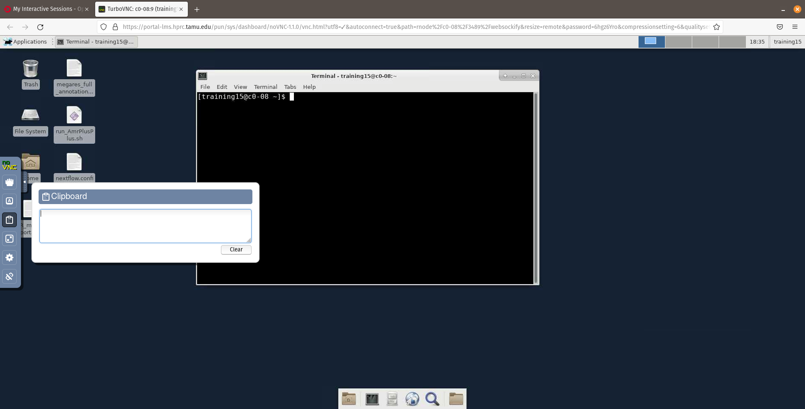
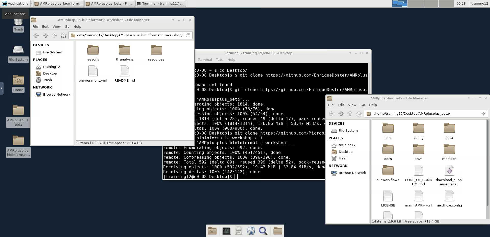

# Bioinformatics - Running the AMR++ pipeline

### Table of contents
* [Login](#log-into-training-portal)
* [Command-line basics](#command-line-basics)
* [Using the terminal to run AMR++](#using-the-terminal-to-run-amr++)
* [Exploring results](#exploring-results)


## Log into training portal

Make sure you can enter the TAMU training portal following [these instructions](./TAMU_Training_portal.md).

Now, from your dashboard we will launch the interactive compute nodes to connect us to the HPC cluster resources. This is where we will run the AMR++ pipeline! Hover over the `Interactive Apps` dropdown tab and click on the `mm Desktop` button to connect.


You will now be able to choose the number of hours let go with 5 and by default 20 cores to use for the workshop. Click the `Launch` to start the queue to load the Interactive Desktop.


You will be queued for a brief moment and then once your session is created we will click the `Launch mm Desktop` button to launch a new web browser tab with your Interactive Desktop.


------------------------------------------
------------------------------------------


## Command-line basics

Now on your new Interacivte Desktop tab, click on the terminal emulator app and then we will begin the command-line portion of the workshop!


A helpful tip on the Interacive Desktop is using the clipboard feature to copy and paste text (if you are not using Google Chrome).



We'll be using a command called `git` to download AMR++ and all of the required software. We will first learn some basics about the command-line, before we run the AMR++ pipeline, including: 

* Basic navigation
* Where am I located! 
* Copying a file
* Running a basic `bash` script

It is important to note the `$` character in the code block examples below represents the end of the command prompt, therefore you will not need to type in or copy it when you run your commands.

<br />

The basic structure of the command line:

```bash
$ command <option(s)> <argument(s)>
```

The first command we will run is `pwd`, this stands for "print working directory" and by default it will print out the `absolute path` of where you are currently standing on the file system. The `absolute path` begins at the root directory `/` and follows the path until the path to the desired directory or file is completed.
```bash
$ pwd
```

To change directories we will use the `cd` command and we will give it the `relative path` to your `Desktop` directory. Here the relative path starts from your working directory (i.e. as if now your `home` directory). This is where you are currently standing on the file system. 

When it comes to the `relative path`  it is important to note there are a couple of special notations to represent relative positions in the file system. These special notations are `.` (dot) and `..` (dot dot). The `.` notation refers to the working directory and the `..` notation refers to the working directory's parent directory.
```bash
$ cd Desktop/
```

Now in your `Desktop` directory we will us the `ls` command. By default it will list the contents of the directory where you are currently standing.
```bash
$ ls
```
Next, lets create a directory where we can practice some basic file manipulation commands by creating an empty file, copying a file from another location, and running an executable file (i.e. a script). 

```bash
$ mkdir practice
```

Now lets navigate into the `practice` directory we just created and list its contents.

```bash
$ cd practice
$ ls
```
As you can see it is empty and there is no output to the terminal screen. Let create an empty a file in our `practice` directory. Lets, then add a line of text to the file with the `echo` command and redirection `>`. To print the standard output of what inside of the file to terminal lets use the `cat` command.

```bash
$ touch hello_world.sh
$ echo "The command-line is actually fun...maybe?" > hello_world.sh
$ cat hello_world.sh
```

Lets now copy a file from another location with the same name. This is important to see, because this will overwrite our file we were just working on. When using commands such as `cp`(copy) `mv`(move) and `rm`(remove) be aware of the potential to unintenially overwrite or remove files. The command-line assumes we are smart :) 
```bash
$ cp /home/training15/hello_world.sh .
```

Now lets run this `bash` script with the `bash` command. Lets see the output!
```bash
$ bash hello_world.sh
```

Lets open our script to brirefly break it down. We will use the `less` command to read the file. To close out of the `less` command we will type the letter `q`. 

```
$ less hello_world.sh
```

Finally, lets return to our `Desktop` directory using the `relative path`. 

```bash
$ cd ..
```

------------------------------------------
------------------------------------------

## Using the terminal to run AMR++


To download AMR++, run the following command:
```bash
$ git clone https://github.com/EnriqueDoster/AMRplusplus.git
```

Next, lets download the files we'll use for the workshop with the following command:
```bash
$ git clone https://github.com/Microbial-Ecology-Group/AMRplusplus_bioinformatic_workshop.git
```

We can quickly get a glimpse at what we just downloaded. You can also click on the folders to look through the files.
```bash
$ ls AMRplusplus_bioinformatic_workshop
$ ls AMRplusplus
```



To start your AMR++ run, go back to the terminal. Now, we'll navigate into the AMR++ directory and use `ls` to view the contents.
```bash
$ cd AMRplusplus
$ ls
```

From this directory, you can run a demonstration of AMR++, but first we'll need to load a module to use a function called `nextflow`. Outside of this workshop, how you make `nextflow` available will vary based on your computing cluster. At the bare minumum, we'll need to use two software; `nextflow` and `singularity`. Here we'll test whether we have either of those programs available.

```bash
$ nextflow
$ singularity
```

As you can see, nextflow does work, however, singularity does not. In this portal, we just need to run this command to load `nextflow`.

```bash
$ module load Nextflow
```

Now, nextflow works:
```bash
$ nextflow -h
```

Finally, we can run AMR++ with this command: 
```bash
$ nextflow run main_AMR++.nf -profile singularity_workshop
```


The standard output to the terminal screen is interactive. Once the run has finished it should look similar as the image below:


## Running your own data with AMR++


Lets look at the reads that we'll be using. 
```bash
$ ls /home/training/AMR_workshop_reads/small_subsample/
```

To analyze these reads, we can use a similar command for AMR++, but we have to change the ``--reads`` parameter. 
```bash
$ nextflow run main_AMR++.nf -profile singularity_workshop --reads "/home/training/AMR_workshop_reads/small_subsample/*_{1,2}.fastq.gz"
```


## Exploring results


Next we will move back to our portal dashboard and download our AMR++ output files locally to our computers to further explore them!


