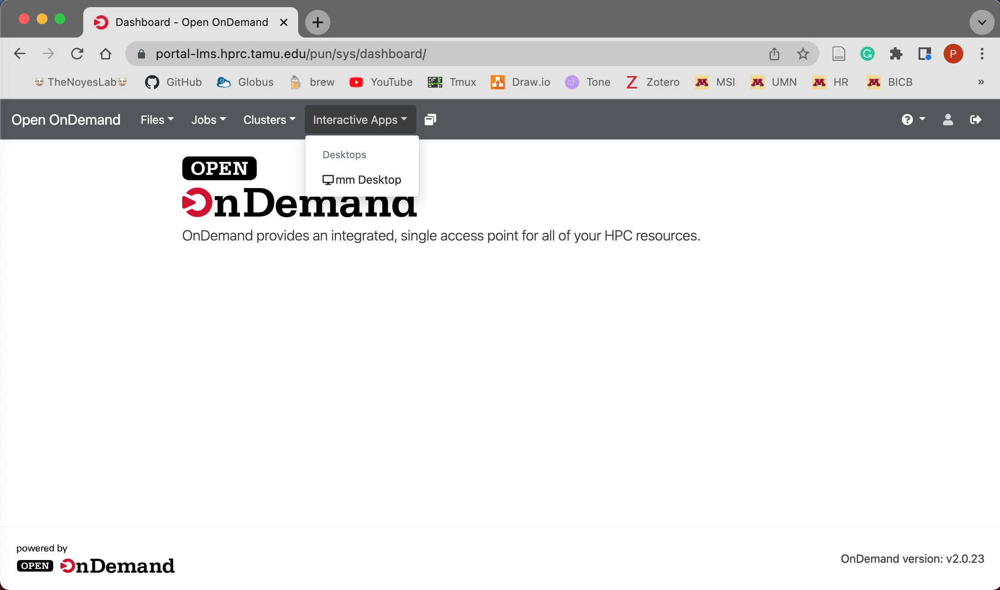
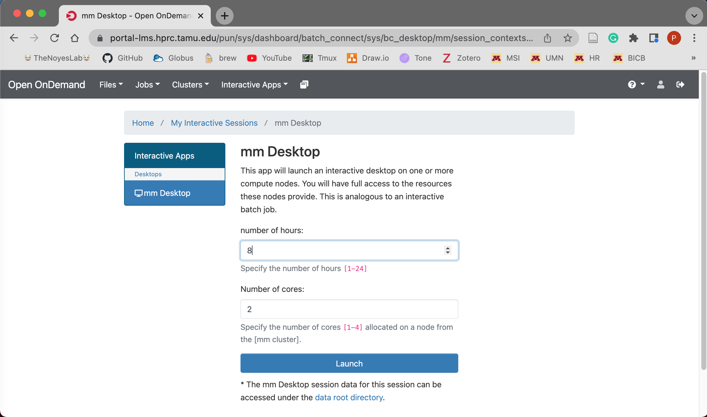
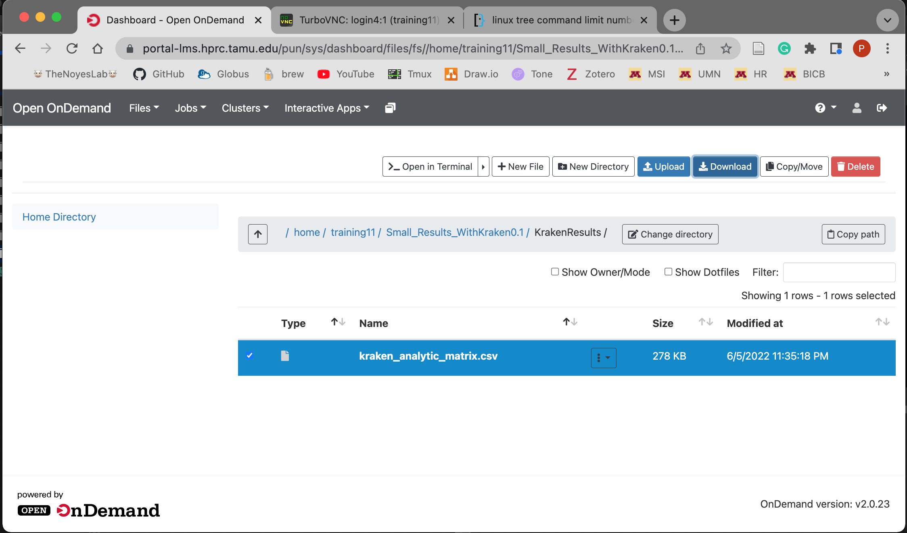

# Bioinformatics - Running the AMR++ pipeline

### Table of contents
* [Login](#log-into-training-portal)
* [Using the terminal](#using-the-terminal)
* 


## Log into training portal

Make sure you can enter the TAMU training portal following [these instructions](./TAMU_Training_portal.md).

Now, from your dashboard we will launch the interactive compute nodes to connect us to the HPC cluster resources. This is where we will run the AMR++ pipeline! Hover over the `Interactive Apps` dropdown tab and click on the `mm Desktop` button to connect.





You will now be able to choose the number of hours and cores you want to use for the workshop. Click the `Launch` to start the queue to load the Interactive Desktop.





You will be queued for a brief moment and then once your session is created we will click the `Launch mm Desktop` button to launch a new web browser tab with your Interactive Desktop.


------------------------------------------
------------------------------------------


## Using the terminal to run AMR++

Now on your new Interacivte Desktop tab, click on the terminal emulator app (the second black app at the bottom of the desktop) and then we will begin the command-line portion of the workshop!


We'll be using a function called `git` to download AMR++ and all of the required software. We will need to do some basic navigation and listing of the file structure before we run the AMR++ pipeline. It is important to note the `$` character in the code block examples below represents the end of the command prompt, therefore you will not need to type in or copy it when you run your commands.

The first command we will run is `pwd`, this stands for "print working directory" and it will print out the `absolute path` of where you are currently standing on the file system.
```bash
$ pwd
```

To change directories we will use the `cd` command and we will give it again the `relative path` to your `Desktop` directory.
```bash
$ cd Desktop/
```

The `ls` command without any options or arguments will output the files and directories of where you are currently standing (i.e. your Desktop).
```bash
$ ls
```


To download AMR++, run the following command:
```bash
$ git clone https://github.com/EnriqueDoster/AMRplusplus.git
```

Next, lets download the files we'll use for the workshop with the following command:
```bash
$ git clone https://github.com/Microbial-Ecology-Group/AMRplusplus_bioinformatic_workshop.git
```

We can quickly get a glimpse at what we just downloaded. You can also click on the folders to look through the files.
```bash
$ ls AMRplusplus_bioinformatic_workshop
$ ls AMRplusplus
```


To start your AMR++ run, go back to the terminal. Now, we'll navigate into the AMR++ directory and use `ls` to view the contents.
```bash
$ cd AMRplusplus
$ ls
```

From this directory, you can run a demonstration of AMR++, but first we'll need to load a module to use a function called `nextflow`. Outside of this workshop, how you make `nextflow` available will vary based on your computing cluster. At the bare minumum, we'll need to use two software; `nextflow` and `singularity`. Here we'll test whether we have either of those programs available.

```bash
$ nextflow
$ singularity
```

As you can see, nextflow does work, however, singularity does not. In this portal, we just need to run this command to load `nextflow`.

```bash
$ module load Nextflow
```

Now, nextflow works:
```bash
$ nextflow -h
```

Finally, we can run AMR++ with this command: 
```bash
$ nextflow run main_AMR++.nf -profile singularity_workshop
```


The standard output to the terminal screen is interactive. Once the run has finished it should look similar as the image below:


## Running your own data with AMR++


Lets look at the reads that we'll be using. 
```bash
$ ls /home/training/AMR_workshop_reads/small_subsample/
```

To analyze these reads, we can use a similar command for AMR++, but we have to change the ``--reads`` parameter. 
```bash
$ nextflow run main_AMR++.nf -profile singularity_workshop --reads "/home/training/AMR_workshop_reads/small_subsample/*_{1,2}.fastq.gz"
```


## Exploring results


Next we will move back to our portal dashboard and download our AMR++ output files locally to our computers to further explore them!





nextflow run main_AMR++.nf -profile singularity_workshop -with-singularity /home/training/qiime2.sif