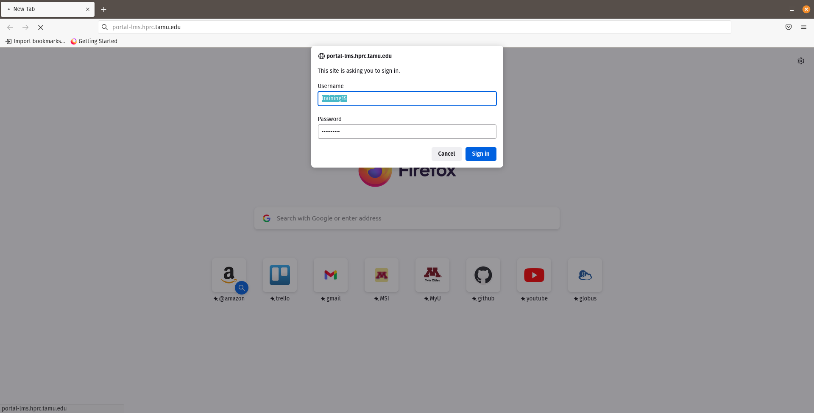
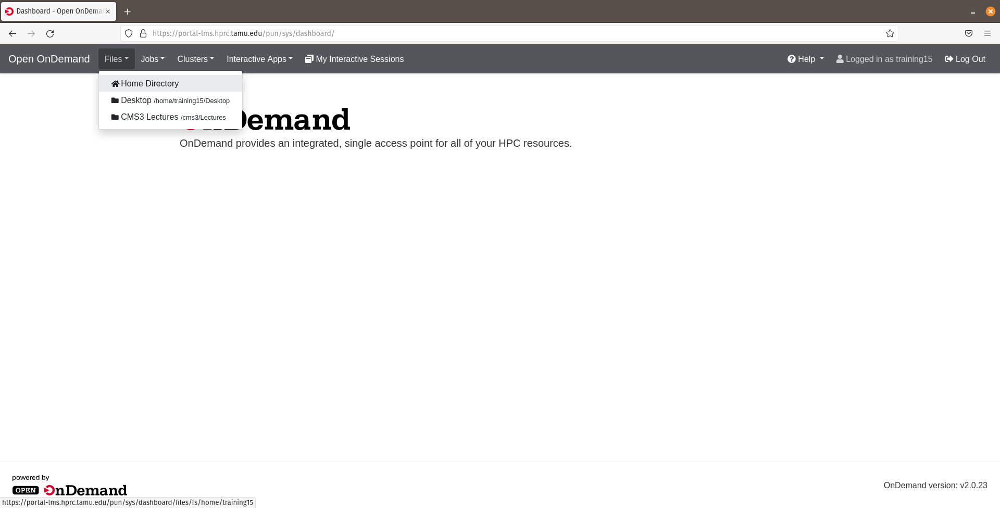
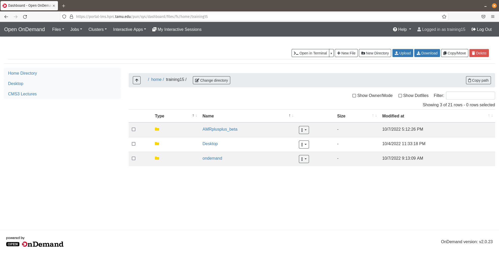
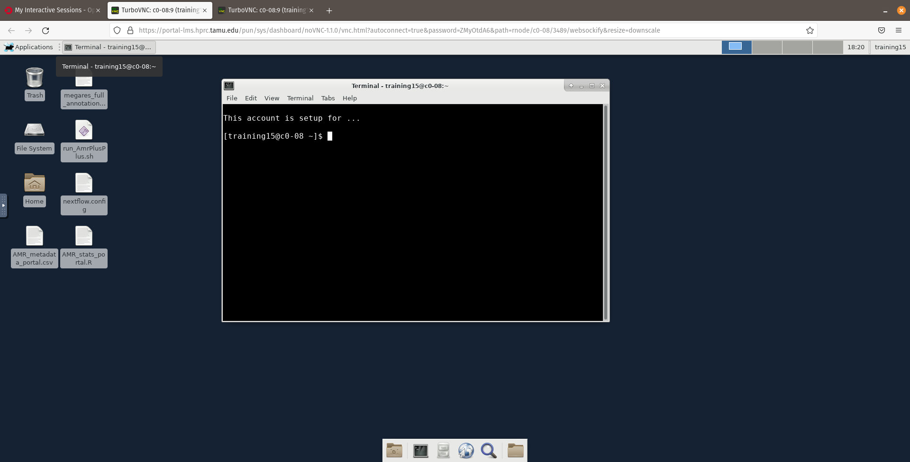
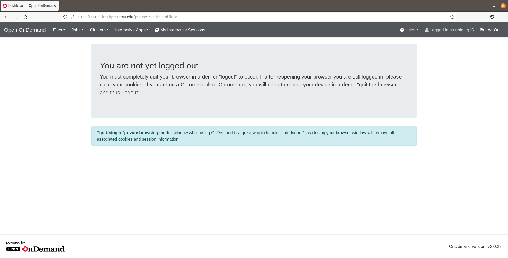

## Training portal

To begin the hands-on portion of the workshop we will load up the TAMU training portal. We recommend using Google Chrome due to copy and paste feature that works directly with the portal and host. Majority of web browser will work, however, safaria will not! 

Paste this web address into your web browser:

```
portal-lms.hprc.tamu.edu
```

As seen in the image below the dropdown box is where you will place your username and password.





Now that you are logged into your portal dashboard...Click on the `Files` dropdown tab and you will be redirected into your training `home` directory.





Here, you will experience a GUI file explorer, this is where we can use the feature to `Upload` or `Download` files to the portal. This will come in handy to download and explore locally, output files produced by AMR++.





If you are in need of support from our instructors, we will navigate to the `My Interactive Sessions` tab. Once on this page we will right click on the `View only (Share-able link)`.


This will pull up a new Interactive Desktop tab (as seen in the image below). You will then copy the URL from your web browser and paste this into the MEG Slack group and an instructor now will be able to have a live view your Interactive Desktop and be able to help you troubleshoot any problems going on!





When you are ready to logout of the portal, click the `Log Out` tab (top right of your browser). Once loaded, you will then see a message on how to completely log out of the training portal.





