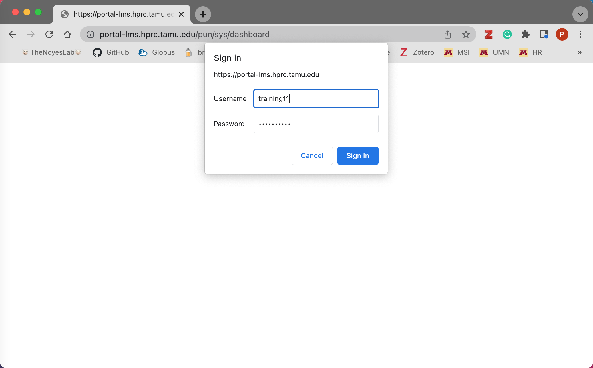

## Training portal

To begin the hands-on portion of the workshop we will load up the training portal. We recommend using Google Chrome due to copy and paste feature that works well with the portal.

Paste this web address into your web browser:

```

portal-lms.hprc.tamu.edu

```

As seen in the image below the dropdown box is where you will place your username and password.





Now that you are logged into your portal dashboard...Click on the `Files` dropdown tab and you will be redirected into your training `home` directory.


Here, you will experience a GUI file explorer, this is where we can use the feature to `Upload` or `Download` files to the portal. This will come in handy to download and explore locally, the count matrix output files produced by AMR++.


If you are in need of support from our "behind-the-scenes" instructors, we will navigate to the `My Interactive Sessions` tab (This will become avialable once we load up a Interactive Desktop in the Bioinformatics section). Once on this page we will right click on the `View only (Share-able link)`.


This will pull up a new Interactive Desktop tab (as seen in the image below). You will then copy the URL from your web browser and paste this into the ASM Slack group to either Dr. Perez (Lisa Perez) or Dr. Pinnell (ljpinnell). They will now be able to have a live view your Interactive Desktop and be able to help you troubleshoot any problems going on!


When you are ready to logout of the portal, click the `Log Out` tab (top right of your browser). Once loaded, you will then see a message on how to completely log out of the training portal.


## Statistics

To start the statistics portion of the workshop we will connect back to our Interactive Desktop node. Like before we will navigate to our `Desktop` directory. Here is where we will launch the Rstudio application.

```bash
$ rstudio
```
On the bottom right panel of Rstudio in the `Files` tab click on the file `AMR_stats_portal.R`. This will pull up the R script we will use to analyze our metagenomic output files. There are a few different ways to step through the code. You can use the keystroke `CTRL+Enter` or `CTRL+Return`. Or you can use the `Run` button at the top of the script. You can also highlight or select specific line(s) you want to run with the keystroke or run button.


While running the running the R code, if you see the warning below, no worries this may just be due to your computer screen dimensions and the portal.


```
Warning message:
In grid.Call(C_textBounds, as.graphicsAnnot(x$label), x$x, x$y,  :
  X11 used font size 8 when 9 was requested
```
